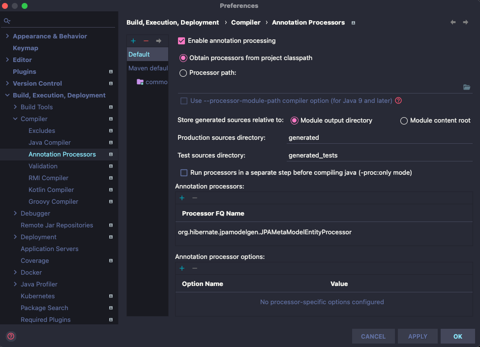

## 스프링 데이터 Common: Web 2부: DomainClassConverter
- 스프링 Converter
    * https://docs.spring.io/spring-framework/docs/current/javadoc-api/org/springframework/core/convert/converter/Converter.html
    * Formatter도 들어 본 것 같은데...

    ```java
    @GetMapping("/posts/{id}")
        public String getAPost(@PathVariable Long id) {
            Optional<Post> byId = postRepository.findById(id);
            Post post = byId.get();
            return post.getTitle();
        }
    ```
  
    ```java
    @GetMapping("/posts/{id}")
        public String getAPost(@PathVariable(“id”) Post post) {
            return post.getTitle();
        }
    ```

## 스프링 데이터 Common: Web 3부: Pageable과 Sort 매개변수
- 스프링 MVC HandlerMethodArgumentResolver
  * 스프링 MVC 핸들러 메소드의 매개변수로 받을 수 있는 객체를 확장하고 싶을 때 사용하는 인터페이스
  * https://docs.spring.io/spring/docs/current/javadoc-api/org/springframework/web/method/support/HandlerMethodArgumentResolver.html
- 페이징과 정렬 관련 매개변수
  * page: 0부터 시작.
  * size: 기본값 20.
  * sort: property,property(,ASC|DESC)
  * 예) sort=created,desc&sort=title (asc가 기본값)

## 스프링 데이터 Common: Web 4부: HATEOAS
- Page를 PagedResource로 변환하기
  * 일단 HATEOAS 의존성 추가 (starter-hateoas)
  * 핸들러 매개변수로 PagedResourcesAssembler
- 리소스로 변환하기 전

  ```json
  {  
     "content":[  
  ...
        {  
           "id":111,
           "title":"jpa",
           "created":null
        }
     ],
     "pageable":{  
        "sort":{  
           "sorted":true,
           "unsorted":false
        },
        "offset":20,
        "pageSize":10,
        "pageNumber":2,
        "unpaged":false,
        "paged":true
     },
     "totalElements":200,
     "totalPages":20,
     "last":false,
     "size":10,
     "number":2,
     "first":false,
     "numberOfElements":10,
     "sort":{  
        "sorted":true,
        "unsorted":false
     }
  }
  
  ```

- 리소스로 변환한 뒤

  ```json
  {  
     "_embedded":{  
        "postList":[  
           {  
              "id":140,
              "title":"jpa",
              "created":null
           },
  ...
           {  
              "id":109,
              "title":"jpa",
              "created":null
           }
        ]
     },
     "_links":{  
        "first":{  
           "href":"http://localhost/posts?page=0&size=10&sort=created,desc&sort=title,asc"
        },
        "prev":{  
           "href":"http://localhost/posts?page=1&size=10&sort=created,desc&sort=title,asc"
        },
        "self":{  
           "href":"http://localhost/posts?page=2&size=10&sort=created,desc&sort=title,asc"
        },
        "next":{  
           "href":"http://localhost/posts?page=3&size=10&sort=created,desc&sort=title,asc"
        },
        "last":{  
           "href":"http://localhost/posts?page=19&size=10&sort=created,desc&sort=title,asc"
        }
     },
     "page":{  
        "size":10,
        "totalElements":200,
        "totalPages":20,
        "number":2
     }
  }
  ```

## 스프링 데이터 Common: 마무리
- 지금까지 살펴본 내용
  * 스프링 데이터 Repository
  * 쿼리 메소드
    * 메소드 이름 보고 만들기
    * 메소드 이름 보고 찾기
  * Repository 정의하기
    * 내가 쓰고 싶은 메소드만 골라서 만들기
    * Null 처리
  * 쿼리 메소드 정의하는 방법
  * 리포지토리 커스터마이징
    * 리포지토리 하나 커스터마이징
    * 모든 리포지토리의 베이스 커스터마이징
  * 도메인 이벤트 Publish
  * 스프링 데이터 확장 기능
    * QueryDSL 연동
    * 웹 지원

## 스프링 데이터 JPA: JPA Repository
- @EnableJpaRepositories
  * 스프링 부트 사용할 때는 사용하지 않아도 자동 설정 됨.
  * 스프링 부트 사용하지 않을 때는 @Configuration과 같이 사용.
- @Repository 애노테이션을 붙여야 하나 말아야 하나...
  * 안붙여도 됩니다.
  * 이미 붙어 있어요. 또 붙인다고 별일이 생기는건 아니지만 중복일 뿐입니다.
- 스프링 @Repository
  * SQLExcpetion 또는 JPA 관련 예외를 스프링의 DataAccessException으로 변환 해준다.

## 스프링 데이터 JPA: 엔티티 저장하기
- JpaRepository의 save()는 단순히 새 엔티티를 추가하는 메소드가 아닙니다.
  * Transient 상태의 객체라면 EntityManager.persist()
  * Detached 상태의 객체라면 EntityManager.merge()
- Transient인지 Detached 인지 어떻게 판단 하는가?
  * 엔티티의 @Id 프로퍼티를 찾는다. 해당 프로퍼티가 null이면 Transient 상태로 판단하고 id가 null이 아니면 Detached 상태로 판단한다.
  * 엔티티가 Persistable 인터페이스를 구현하고 있다면 isNew() 메소드에 위임한다.
  * JpaRepositoryFactory를 상속받는 클래스를 만들고 getEntityInfomration()을 오버라이딩해서 자신이 원하는 판단 로직을 구현할 수도 있습니다.
- EntityManager.persist()
  * https://docs.oracle.com/javaee/6/api/javax/persistence/EntityManager.html#persist(java.lang.Object)
  * Persist() 메소드에 넘긴 그 엔티티 객체를 Persistent 상태로 변경합니다.


- EntityManager.merge()
  * https://docs.oracle.com/javaee/6/api/javax/persistence/EntityManager.html#merge(java.lang.Object)
  * Merge() 메소드에 넘긴 그 엔티티의 복사본을 만들고, 그 복사본을 다시 Persistent 상태로 변경하고 그 복사본을 반환합니다.


## 스프링 데이터 JPA: 쿼리 메소드
- 쿼리 생성하기
  * https://docs.spring.io/spring-data/jpa/docs/current/reference/html/#jpa.query-methods.query-creation
  * And, Or
  * Is, Equals
  * LessThan, LessThanEqual, GreaterThan, GreaterThanEqual
  * After, Before
  * IsNull, IsNotNull, NotNull
  * Like, NotLike
  * StartingWith, EndingWith, Containing
  * OrderBy
  * Not, In, NotIn
  * True, False
  * IgnoreCase
- 쿼리 찾아쓰기
  * 엔티티에 정의한 쿼리 찾아 사용하기 JPA Named 쿼리
    * @NamedQuery
    * @NamedNativeQuery
  * 리포지토리 메소드에 정의한 쿼리 사용하기
    * @Query
    * @Query(nativeQuery=true)

## 스프링 데이터 JPA: 쿼리 메소드 Sort
- 이전과 마찬가지로 Pageable이나 Sort를 매개변수로 사용할 수 있는데, @Query와 같이 사용할 때 제약 사항이 하나 있습니다.
- Order by 절에서 함수를 호출하는 경우에는 Sort를 사용하지 못합니다. 그 경우에는 JpaSort.unsafe()를 사용 해야 합니다.
  * Sort는 그 안에서 사용한 프로퍼티 또는 alias가 엔티티에 없는 경우에는 예외가 발생합니다.
  * JpaSort.unsafe()를 사용하면 함수 호출을 할 수 있습니다.
    * JpaSort.unsafe(“LENGTH(firstname)”);

## 스프링 데이터 JPA: Named Parameter과 SpEL
- Named Parameter
  * @Query에서 참조하는 매개변수를 ?1, ?2 이렇게 채번으로 참조하는게 아니라 이름으로 :title 이렇게 참조하는 방법은 다음과 같습니다.
  
  ```java
  @Query("SELECT p FROM Post AS p WHERE p.title = :title")
  List<Post> findByTitle(@Param("title") String title, Sort sort);
  ```

- SpEL
  * 스프링 표현 언어
  * https://docs.spring.io/spring/docs/current/spring-framework-reference/core.html#expressions
  * @Query에서 엔티티 이름을 #{#entityName} 으로 표현할 수 있습니다.
  
  ```java
  @Query("SELECT p FROM #{#entityName} AS p WHERE p.title = :title")
  List<Post> findByTitle(@Param("title") String title, Sort sort);
  ```

## 스프링 데이터 JPA: Update 쿼리 메소드
- 쿼리 생성하기
  * find...
  * count...
  * delete...
  * 흠.. update는 어떻게 하지?
- Update 또는 Delete 쿼리 직접 정의하기
  * @Modifying @Query
  * 추천하진 않습니다.

  ```java
  @Modifying(clearAutomatically = true, flushAutomatically = true)
  @Query("UPDATE Post p SET p.title = ?2 WHERE p.id = ?1")
  int updateTitle(Long id, String title);
  ```

## 스프링 데이터 JPA: EntityGraph
- 쿼리 메소드 마다 연관 관계의 Fetch 모드를 설정 할 수 있습니다.
- @NamedEntityGraph
  * @Entity에서 재사용할 여러 엔티티 그룹을 정의할 때 사용.
- @EntityGraph
  * @NamedEntityGraph에 정의되어 있는 엔티티 그룹을 사용 함.
  * 그래프 타입 설정 가능
    * (기본값) FETCH: 설정한 엔티티 애트리뷰트는 EAGER 패치 나머지는 LAZY 패치.
    * LOAD: 설정한 엔티티 애트리뷰트는 EAGER 패치 나머지는 기본 패치 전략 따름.

## 스프링 데이터 JPA: Projection
- 엔티티의 일부 데이터만 가져오기.
- 인터페이스 기반 프로젝션
  * Nested 프로젝션 가능.
  * Closed 프로젝션
    * 쿼리를 최적화 할 수 있다. 가져오려는 애트리뷰트가 뭔지 알고 있으니까.
    * Java 8의 디폴트 메소드를 사용해서 연산을 할 수 있다.
  * Open 프로젝션
    * @Value(SpEL)을 사용해서 연산을 할 수 있다. 스프링 빈의 메소드도 호출 가능.
    * 쿼리 최적화를 할 수 없다. SpEL을 엔티티 대상으로 사용하기 때문에.
- 클래스 기반 프로젝션
  * DTO
  * 롬복 @Value로 코드 줄일 수 있음
- 다이나믹 프로젝션
  * 프로젝션 용 메소드 하나만 정의하고 실제 프로젝션 타입은 타입 인자로 전달하기.

  ```java
  <T> List<T> findByPost_Id(Long id, Class<T> type);
  ```

## 스프링 데이터 JPA: Specifications
- 에릭 에반스의 책 DDD에서 언급하는 Specification 개념을 차용 한 것으로 QueryDSL의 Predicate와 비슷합니다.
- 설정 하는 방법
  * https://docs.jboss.org/hibernate/stable/jpamodelgen/reference/en-US/html_single/
  * 의존성 설정
  * 플러그인 설정
  * IDE에 애노테이션 처리기 설정
  * 코딩 시작

  ```xml
  <dependency>
    <groupId>org.hibernate</groupId>
    <artifactId>hibernate-jpamodelgen</artifactId>
  </dependency>
  ```
  
  ```xml
              <plugin>
                  <groupId>org.bsc.maven</groupId>
                  <artifactId>maven-processor-plugin</artifactId>
                  <version>2.0.5</version>
                  <executions>
                      <execution>
                          <id>process</id>
                          <goals>
                              <goal>process</goal>
                          </goals>
                          <phase>generate-sources</phase>
                          <configuration>
                              <processors>
                                  <processor>org.hibernate.jpamodelgen.JPAMetaModelEntityProcessor</processor>
                              </processors>
                          </configuration>
                      </execution>
                  </executions>
                  <dependencies>
                      <dependency>
                          <groupId>org.hibernate</groupId>
                          <artifactId>hibernate-jpamodelgen</artifactId>
                          <version>${hibernate.version}</version>
                      </dependency>
                  </dependencies>
              </plugin>
  ```
  
- org.hibernate.jpamodelgen.JPAMetaModelEntityProcessor



```java
public interface CommentRepository extends JpaRepository<Comment, Long>, JpaSpecificationExecutor<Comment> {
}
```

## 스프링 데이터 JPA: Query by Example
- QBE는 필드 이름을 작성할 필요 없이(뻥) 단순한 인터페이스를 통해 동적으로 쿼리를 만드는 기능을 제공하는 사용자 친화적인 쿼리 기술입니다.
- Example = Probe + ExampleMatcher
  * Probe는 필드에 어떤 값들을 가지고 있는 도메인 객체.
  * ExampleMatcher는 Prove에 들어있는 그 필드의 값들을 어떻게 쿼리할 데이터와 비교할지 정의한 것.
  * Example은 그 둘을 하나로 합친 것. 이걸로 쿼리를 함.
- 장점
  * 별다른 코드 생성기나 애노테이션 처리기 필요 없음.
  * 도메인 객체 리팩토링 해도 기존 쿼리가 깨질 걱정하지 않아도 됨.(뻥)
  * 데이터 기술에 독립적인 API
- 단점
  * nested 또는 프로퍼티 그룹 제약 조건을 못 만든다.
  * 조건이 제한적이다. 문자열은 starts/contains/ends/regex 가 가능하고 그밖에 property는 값이 정확히 일치해야 한다.
- QueryByExampleExecutor
  * https://docs.spring.io/spring-data/jpa/docs/current/reference/html/#query-by-example