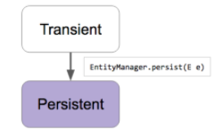
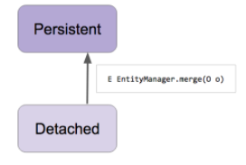

## 스프링 데이터 Common: Web 2부: DomainClassConverter
- 스프링 Converter
    * https://docs.spring.io/spring-framework/docs/current/javadoc-api/org/springframework/core/convert/converter/Converter.html
    * Formatter도 들어 본 것 같은데...

    ```java
    @GetMapping("/posts/{id}")
        public String getAPost(@PathVariable Long id) {
            Optional<Post> byId = postRepository.findById(id);
            Post post = byId.get();
            return post.getTitle();
        }
    ```
  
    ```java
    @GetMapping("/posts/{id}")
        public String getAPost(@PathVariable(“id”) Post post) {
            return post.getTitle();
        }
    ```

## 스프링 데이터 Common: Web 3부: Pageable과 Sort 매개변수
- 스프링 MVC HandlerMethodArgumentResolver
  * 스프링 MVC 핸들러 메소드의 매개변수로 받을 수 있는 객체를 확장하고 싶을 때 사용하는 인터페이스
  * https://docs.spring.io/spring/docs/current/javadoc-api/org/springframework/web/method/support/HandlerMethodArgumentResolver.html
- 페이징과 정렬 관련 매개변수
  * page: 0부터 시작.
  * size: 기본값 20.
  * sort: property,property(,ASC|DESC)
  * 예) sort=created,desc&sort=title (asc가 기본값)

## 스프링 데이터 Common: Web 4부: HATEOAS
- Page를 PagedResource로 변환하기
  * 일단 HATEOAS 의존성 추가 (starter-hateoas)
  * 핸들러 매개변수로 PagedResourcesAssembler
- 리소스로 변환하기 전

  ```json
  {  
     "content":[  
  ...
        {  
           "id":111,
           "title":"jpa",
           "created":null
        }
     ],
     "pageable":{  
        "sort":{  
           "sorted":true,
           "unsorted":false
        },
        "offset":20,
        "pageSize":10,
        "pageNumber":2,
        "unpaged":false,
        "paged":true
     },
     "totalElements":200,
     "totalPages":20,
     "last":false,
     "size":10,
     "number":2,
     "first":false,
     "numberOfElements":10,
     "sort":{  
        "sorted":true,
        "unsorted":false
     }
  }
  
  ```

- 리소스로 변환한 뒤

  ```json
  {  
     "_embedded":{  
        "postList":[  
           {  
              "id":140,
              "title":"jpa",
              "created":null
           },
  ...
           {  
              "id":109,
              "title":"jpa",
              "created":null
           }
        ]
     },
     "_links":{  
        "first":{  
           "href":"http://localhost/posts?page=0&size=10&sort=created,desc&sort=title,asc"
        },
        "prev":{  
           "href":"http://localhost/posts?page=1&size=10&sort=created,desc&sort=title,asc"
        },
        "self":{  
           "href":"http://localhost/posts?page=2&size=10&sort=created,desc&sort=title,asc"
        },
        "next":{  
           "href":"http://localhost/posts?page=3&size=10&sort=created,desc&sort=title,asc"
        },
        "last":{  
           "href":"http://localhost/posts?page=19&size=10&sort=created,desc&sort=title,asc"
        }
     },
     "page":{  
        "size":10,
        "totalElements":200,
        "totalPages":20,
        "number":2
     }
  }
  ```

## 스프링 데이터 Common: 마무리
- 지금까지 살펴본 내용
  * 스프링 데이터 Repository
  * 쿼리 메소드
    * 메소드 이름 보고 만들기
    * 메소드 이름 보고 찾기
  * Repository 정의하기
    * 내가 쓰고 싶은 메소드만 골라서 만들기
    * Null 처리
  * 쿼리 메소드 정의하는 방법
  * 리포지토리 커스터마이징
    * 리포지토리 하나 커스터마이징
    * 모든 리포지토리의 베이스 커스터마이징
  * 도메인 이벤트 Publish
  * 스프링 데이터 확장 기능
    * QueryDSL 연동
    * 웹 지원

## 스프링 데이터 JPA: JPA Repository
- @EnableJpaRepositories
  * 스프링 부트 사용할 때는 사용하지 않아도 자동 설정 됨.
  * 스프링 부트 사용하지 않을 때는 @Configuration과 같이 사용.
- @Repository 애노테이션을 붙여야 하나 말아야 하나...
  * 안붙여도 됩니다.
  * 이미 붙어 있어요. 또 붙인다고 별일이 생기는건 아니지만 중복일 뿐입니다.
- 스프링 @Repository
  * SQLExcpetion 또는 JPA 관련 예외를 스프링의 DataAccessException으로 변환 해준다.

## 스프링 데이터 JPA: 엔티티 저장하기
- JpaRepository의 save()는 단순히 새 엔티티를 추가하는 메소드가 아닙니다.
  * Transient 상태의 객체라면 EntityManager.persist()
  * Detached 상태의 객체라면 EntityManager.merge()
- Transient인지 Detached 인지 어떻게 판단 하는가?
  * 엔티티의 @Id 프로퍼티를 찾는다. 해당 프로퍼티가 null이면 Transient 상태로 판단하고 id가 null이 아니면 Detached 상태로 판단한다.
  * 엔티티가 Persistable 인터페이스를 구현하고 있다면 isNew() 메소드에 위임한다.
  * JpaRepositoryFactory를 상속받는 클래스를 만들고 getEntityInfomration()을 오버라이딩해서 자신이 원하는 판단 로직을 구현할 수도 있습니다.
- EntityManager.persist()
  * https://docs.oracle.com/javaee/6/api/javax/persistence/EntityManager.html#persist(java.lang.Object)
  * Persist() 메소드에 넘긴 그 엔티티 객체를 Persistent 상태로 변경합니다.



- EntityManager.merge()
  * https://docs.oracle.com/javaee/6/api/javax/persistence/EntityManager.html#merge(java.lang.Object)
  * Merge() 메소드에 넘긴 그 엔티티의 복사본을 만들고, 그 복사본을 다시 Persistent 상태로 변경하고 그 복사본을 반환합니다.

