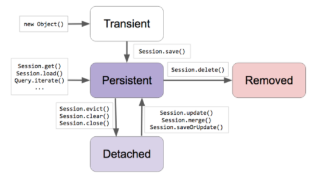

## JPA 프로그래밍: 프로젝트 세팅
- 데이터베이스 실행
    * PostgreSQL 도커 컨테이너 재사용
    * docker start postgres_boot
- 스프링 부트
    * 스프링 부트 v2.*
    * 스프링 프레임워크 v5.*
- 스프링 부트 스타터 JPA
    * JPA 프로그래밍에 필요한 의존성 추가
        * JPA v2.*
        * Hibernate v5.*
    * 자동 설정: HibernateJpaAutoConfiguration
        * 컨테이너가 관리하는 EntityManager (프록시) 빈 설정
        * PlatformTransactionManager 빈 설정
- JDBC 설정
    * jdbc:postgresql://localhost:5432/springdata
    * sungbin
    * pass
- application.properties
    * spring.jpa.properties.hibernate.jdbc.lob.non_contextual_creation=true
    * spring.jpa.hibernate.ddl-auto=create

## JPA 프로그래밍: 엔티티 맵핑
- @Entity
    * “엔티티”는 객체 세상에서 부르는 이름.
    * 보통 클래스와 같은 이름을 사용하기 때문에 값을 변경하지 않음.
    * 엔티티의 이름은 JQL에서 쓰임.
- @Table
    * “릴레이션" 세상에서 부르는 이름.
    * @Entity의 이름이 기본값.
    * 테이블의 이름은 SQL에서 쓰임.
- @Id
    * 엔티티의 주키를 맵핑할 때 사용.
    * 자바의 모든 primitive 타입과 그 랩퍼 타입을 사용할 수 있음
        * Date랑 BigDecimal, BigInteger도 사용 가능.
    * 복합키를 만드는 맵핑하는 방법도 있지만 그건 논외로..
- @GeneratedValue
    * 주키의 생성 방법을 맵핑하는 애노테이션
    * 생성 전략과 생성기를 설정할 수 있다.
        * 기본 전략은 AUTO: 사용하는 DB에 따라 적절한 전략 선택
        * TABLE, SEQUENCE, IDENTITY 중 하나.
- @Column
    * unique
    * nullable
    * length
    * columnDefinition
- @Temporal
    * JPA 2.1까지는 Date와 Calendar만 지원. 지금은 Period...등등 다양하게 지원
- @Transient
    * 컬럼으로 맵핑하고 싶지 않은 멤버 변수에 사용.
- application.properties
    * spring.jpa.show-sql=true
    * spring.jpa.properties.hibernate.format_sql=true

## JPA 프로그래밍: Value 타입 맵핑
- 엔티티 타입과 Value 타입 구분
  * 식별자가 있어야 하는가.
  * 독립적으로 존재해야 하는가.
- Value 타입 종류
  * 기본 타입 (String, Date, Boolean, ...)
  * Composite Value 타입
  * Collection Value 타입
    * 기본 타입의 콜렉션
    * 컴포짓 타입의 콜렉션
- Composite Value 타입 맵핑
  * @Embeddable
  * @Embedded
  * @AttributeOverrides
  * @AttributeOverride

```java
@Embeddable
public class Address {

    private String street;

    private String city;

    private String state;

    private String zipCode;

}
```

```java
@Embedded
    @AttributeOverrides({
        @AttributeOverride(name = "street", column = @Column(name = "home_street"))
    })
    private Address address;
```

## JPA 프로그래밍: 1대다 맵핑
- 관계에는 항상 두 엔티티가 존재 합니다.
  * 둘 중 하나는 그 관계의 주인(owning)이고
  * 다른 쪽은 종속된(non-owning) 쪽입니다.
  * 해당 관계의 반대쪽 레퍼런스를 가지고 있는 쪽이 주인.
- 단방향에서의 관계의 주인은 명확합니다.
  * 관계를 정의한 쪽이 그 관계의 주인입니다.
- 단방향 @ManyToOne
  * 기본값은 FK 생성
- 단방향 @OneToMany
  * 기본값은 조인 테이블 생성
- 양방향
  * FK 가지고 있는 쪽이 오너 따라서 기본값은 @ManyToOne 가지고 있는 쪽이 주인.
  * 주인이 아닌쪽(@OneToMany쪽)에서 mappedBy 사용해서 관계를 맺고 있는 필드를 설정해야 합니다.
- 양방향
  * @ManyToOne (이쪽이 주인)
  * @OneToMany(mappedBy)
  * 주인한테 관계를 설정해야 DB에 반영이 됩니다.

## JPA 프로그래밍: Cascade
- 엔티티의 상태 변화를 전파 시키는 옵션.
- 잠깐? 엔티티의 상태가 뭐지?
  * Transient: JPA가 모르는 상태
  * Persistent: JPA가 관리중인 상태 (1차 캐시, Dirty Checking, Write Behind, ...)
    * Dirty Checking (객체의 변경사항을 계속해서 감지) and Write Behind (객체의 상태변화를 DB에 최대한 필요한 시점에 늦게 반영)
  * Detached: JPA가 더이상 관리하지 않는 상태.
  * Removed: JPA가 관리하긴 하지만 삭제하기로 한 상태.

