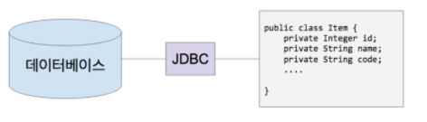

## 관계형 데이터베이스와 자바
- JDBC
    * (관계형) 데이터베이스와 자바의 연결 고리

    

- JDBC
    * DataSource / DriverManager
    * Connection
    * PreparedStatement
- SQL
    * DDL
    * DML
- 무엇이 문제인가?
    * SQL을 실행하는 비용이 비싸다.
    * SQL이 데이터베이스 마다 다르다.
    * 스키마를 바꿨더니 코드가 너무 많이 바뀌네...
    * 반복적인 코드가 너무 많아.
    * 당장은 필요가 없는데 언제 쓸 줄 모르니까 미리 다 읽어와야 하나...
- 의존성 추가

    ```xml
    <dependency>
       <groupId>org.postgresql</groupId>
       <artifactId>postgresql</artifactId>
    </dependency>
    ```

- PostgreSQL 설치 및 서버 실행 (docker)

```bash
docker run -p 5432:5432 -e POSTGRES_PASSWORD=pass -e POSTGRES_USER=keesun -e POSTGRES_DB=springdata --name postgres_boot -d postgres

docker exec -i -t postgres_boot bash
```

```postgresql
su - postgres

psql springdata

데이터베이스 조회
\list

테이블 조회
\dt

쿼리
SELECT * FROM account;
```

## ORM: Object-Relation Mapping
- JDBC 사용

```java
try (Connection connection = DriverManager.getConnection(url, username, password);) {
            System.out.println("Connection created: " + connection);
//            String sql = "CREATE TABLE ACCOUNT (id int, username varchar(255), password varchar(255));";
            String sql = "INSERT INTO ACCOUNT VALUES (1, 'sungbin', 'pass');";
            try (PreparedStatement statement = connection.prepareStatement(sql);) {
                statement.execute();
            }
        } catch (SQLException e) {
            e.printStackTrace();
        }
```

- 도메인 모델 사용

```java
Account account = new Account(“sungbin”, “pass”);
accountRepository.save(account);
```

- JDBC 대신 도메인 모델 사용하려는 이유?
  * 객체 지향 프로그래밍의 장점을 활용하기 좋으니까.
  * 각종 디자인 패턴
  * 코드 재사용
  * 비즈니스 로직 구현 및 테스트 편함.

> ORM은 애플리케이션의 클래스와 SQL 데이터베이스의 테이블 사이의 맵핑 정보를 기술한 메타데이터를 사용하여, 자바 애플리케이션의 객체를 SQL 데이터베이스의 테이블에 자동으로 (또 깨끗하게) 영속화 해주는 기술입니다.

> In a nutshell, object/relational mapping is the automated (and transparent) persistence of objects in a Java application to the tables in an SQL database, using metadata that describes the mapping between the classes of the application and the schema of the SQL database.
> - Java Persistence with Hibernate, Second Edition

|장점| 단점  |
|------|-----|
|생산성| 학습비용 |
|유지보수성| -   |
|성능| -   |
|밴더 독립성| -   |


## ORM: 패러다임 불일치
- 객체를 릴레이션에 맵핑하려니 발생하는 문제들과 해결책
- 밀도(Granularity) 문제

| 객체                   | 릴레이션                |
|----------------------|---------------------|
| 다양한 크기의 객체를 만들 수 있음. | 테이블                 |
| 커스텀한 타입 만들기 쉬움.      | 기본 데이터 타입 (UDT는 비추) |

- 서브타입(Subtype) 문제

| 객체                   | 릴레이션                                             |
|----------------------|--------------------------------------------------|
| 상속 구조 만들기 쉬움. | 테이블 상속이라는게 없음.                                   |
| 다형성.     | 상속 기능을 구현했다 하더라도 표준 기술이 아님. 다형적인 관계를 표현할 방법이 없음. |

- 식별성(Identity) 문제

| 객체                   | 릴레이션                |
|----------------------|---------------------|
| 레퍼런스 동일성 (==) | 주키 (primary key)                 |
| 인스턴스 동일성 (equals() 메소드)      |  |

- 관계(Association) 문제

| 객체                   | 릴레이션                |
|----------------------|---------------------|
| 객체 레퍼런스로 관계 표현. | 외래키(foreign key)로 관계 표현.|
| 근본적으로 ‘방향'이 존재 한다.      | ‘방향'이라는 의미가 없음. 그냥 Join으로 아무거나 묶을 수 있음. |
|          다대다 관계를 가질 수 있음            | 태생적으로 다대다 관계를 못만들고, 조인 테이블 또는 링크 테이블을 사용해서 두개의 1대다 관계로 풀어야 함. |

- 데이터 네비게이션(Navigation)의 문제

| 객체                   | 릴레이션 |
|----------------------|---|
| 레퍼런스를 이용해서 다른 객체로 이동 가능. | 하지만 그런 방식은 릴레이션에서 데이터를 조회하는데 있어서 매우 비효율적이다.|
| 콜렉션을 순회할 수도 있음.     | 데이터베이스에 요청을 적게 할 수록 성능이 좋다. 따라서 Join을 쓴다. |
|                      |   하지만, 너무 많이 한번에 가져오려고 해도 문제다.|
|                      |   그렇다고 lazy loading을 하자니 그것도 문제다. (n+1 select)   |